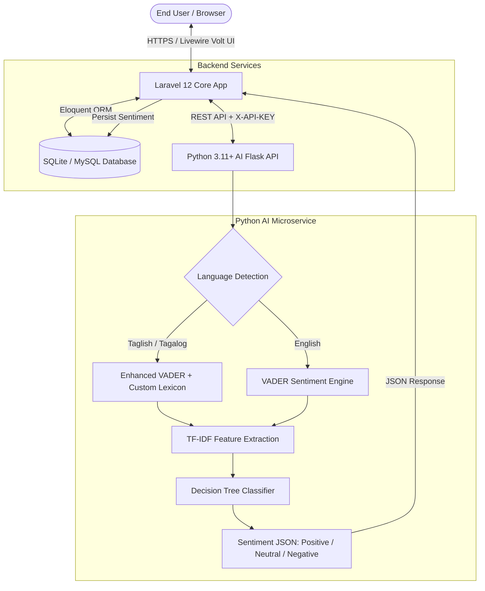

# GRC 360 Degree Evaluation System

A role-based academic evaluation platform with an integrated AI sentiment analysis pipeline to evaluate faculty performance, process 360-degree institutional appraisals, and classify qualitative feedback in English and Tagalog/Taglish.

[](https://laravel.com)
[](https://livewire.laravel.com/docs/volt)
[](https://tailwindcss.com)
[](https://python.org)
[](https://scikit-learn.org)
[](https://www.nltk.org)
[](https://pestphp.com)
[](LICENSE)

---

## 📑 Table of Contents

- [Overview](#-overview)
- [Key Features](#-key-features)
- [System Architecture](#-system-architecture)
- [Tech Stack](#-tech-stack)
- [Quick Start](#-quick-start)
  - [Prerequisites](#prerequisites)
  - [Step-by-Step Installation](#step-by-step-installation)
- [Running the Application](#-running-the-application)
- [User Roles &amp; Demo Credentials](#-user-roles--demo-credentials)
- [AI Sentiment Engine](#-ai-sentiment-engine)
- [Artisan Commands](#-artisan-commands)
- [Code Quality &amp; Testing](#-code-quality--testing)
- [Project Structure](#-project-structure)
- [License](#-license)

---

## 📌 Overview

The **Academic Evaluation System** is an enterprise-grade, full-stack institutional evaluation platform designed for Higher Education Institutions (HEIs). Built with **Laravel 12**, **Livewire Volt**, and a dedicated **Python AI Microservice**, it facilitates 360-degree performance appraisals combining numeric ratings with deep natural language sentiment analysis on student and peer feedback.

Equipped with a **customized bilingual Tagalog-Taglish & English NLP pipeline**, the system accurately interprets localized academic colloquialisms, student sentiments, and constructive suggestions to generate automated sentiment classifications, actionable analytics, and executive faculty performance rankings.

---

## ✨ Key Features

### 👥 360° Multi-Role Evaluation Hierarchy

* **7 Specialized Roles**: System Administrator, College Dean, Department Head, Program Head, Faculty Professor, Student, and Administrative Staff.
* **Weighted Evaluation Breakdown**:
  * **Students (40%)**: Upward classroom instruction, methodology, and learning delivery evaluations.
  * **Superiors / Deans & Program Heads (40%)**: Administrative adherence, leadership, and curricular competence.
  * **Peers (15%)**: Departmental collaboration, teamwork, and collegiality.
  * **Self-Evaluation (5%)**: Personal reflection, professional growth, and academic milestones.

### 🤖 Hybrid AI Sentiment Analysis Pipeline

* **Dual NLP Classification**:
  * **Lexicon-Based (Enhanced NLTK VADER)**: Tailored with custom Philippine higher education lexicons, Tagalog contextual negations (`hindi`, `di`, `wala`, `huwag`), and idiomatic sentiment modifiers.
  * **Machine Learning Classifier**: Scikit-Learn TF-IDF Vectorizer + Decision Tree Classifier trained on institutional dataset annotations and real historical comments.
* **Taglish & English Context Auto-Detection**: Dynamic language marker detection ensuring context-aware tokenization and phrase normalization.
* **Continuous Online Training**: One-click administrative retrain interfaces and CLI pipeline updates.

### 📊 Comprehensive Analytics & Executive Dashboards

* **Dean & Program Head Portals**: High-level faculty score comparisons, department ranking leaderboards, and rating distribution graphs.
* **Faculty Performance Portals**: Confidential breakdown of scores across all evaluation criteria with summarized sentiment trends.
* **Automated Deadline Notifications**: Milestone-based email and in-app reminders for pending evaluations.
* **Complete Audit Trail**: Integrated Spatie Activity Logging tracking institutional configuration changes and evaluation lifecycle events.

### ⚡ Lightning-Fast Reactive User Interface

* Powered by **Livewire Volt (Single File Components)**, **Flux UI**, and **Tailwind CSS v4** for an instantaneous Single Page Application (SPA) feel without the overhead of heavy client-side JavaScript frameworks.

---

## 🏛 System Architecture



---

## 🛠 Tech Stack

| Layer                              | Technologies                                                                                                                                                                                   |
| :--------------------------------- | :--------------------------------------------------------------------------------------------------------------------------------------------------------------------------------------------- |
| **Backend Framework**        | [Laravel 12](https://laravel.com) (PHP 8.2+)                                                                                                                                                    |
| **Frontend Architecture**    | [Livewire 3](https://livewire.laravel.com) & [Livewire Volt](https://livewire.laravel.com/docs/volt), [Alpine.js](https://alpinejs.dev)                                                           |
| **UI & Styling**             | [Tailwind CSS v4](https://tailwindcss.com), [Flux UI](https://fluxui.dev)                                                                                                                        |
| **AI / NLP Microservice**    | [Python 3.11+](https://python.org), [Flask](https://flask.palletsprojects.com), [NLTK (VADER)](https://www.nltk.org), [Scikit-Learn](https://scikit-learn.org), [Pandas](https://pandas.pydata.org) |
| **Database**                 | SQLite (Default / Development), MySQL / PostgreSQL (Production-ready)                                                                                                                          |
| **Authorization & Security** | [Spatie Laravel Permission](https://spatie.be/docs/laravel-permission), Role-based middleware, API key tokens                                                                                   |
| **Testing & Tooling**        | [Pest PHP](https://pestphp.com), [Larastan / PHPStan](https://github.com/larastan/larastan), [Laravel Pint](https://laravel.com/docs/pint)                                                        |

---

## 🚀 Quick Start

### Prerequisites

Make sure you have the following installed on your machine:

* **PHP** `^8.2` or higher (with `pdo_sqlite`, `mbstring`, `openssl`, `curl` extensions enabled)
* **Composer** `^2.x`
* **Node.js** `^20.x` & **npm**
* **Python** `3.10` - `3.13` & `pip`

---

### Step-by-Step Installation

#### 1. Clone & Setup Backend

```bash
# Clone the repository
git clone https://github.com/thehonored1ne/EvaluationSystemCapstone.git
cd EvaluationSystemCapstone

# Install PHP dependencies
composer install

# Configure environment
cp .env.example .env

# Generate application encryption key
php artisan key:generate
```

#### 2. Initialize Database & Seed Demo Data

```bash
# Run database migrations and seed full academic demo structure
php artisan migrate --seed
```

#### 3. Setup Frontend Assets

```bash
# Install Node dependencies
npm install

# Compile assets with Vite
npm run dev
```

#### 4. Setup Python AI Sentiment Microservice

Open a new terminal window:

```bash
# Navigate to the python directory
cd python

# Create and activate virtual environment
# Windows (PowerShell):
python -m venv venv
.\venv\Scripts\activate

# macOS / Linux:
python3 -m venv venv
source venv/bin/activate

# Install Python requirements
pip install -r requirements.txt
```

---

## 🏃 Running the Application

To run the full stack, you need the **Laravel Web Server**, the **Vite Asset Bundler**, and the **Python AI Microservice** running:

### Option A: All-in-One Dev Runner (Recommended)

You can start all processes concurrently via Composer:

```bash
composer run dev
```

### Option B: Separate Terminal Processes

| Terminal             | Service                   | Command                  | Port / URL                |
| :------------------- | :------------------------ | :----------------------- | :------------------------ |
| **Terminal 1** | **Laravel App**     | `php artisan serve`    | `http://127.0.0.1:8000` |
| **Terminal 2** | **Vite Dev Server** | `npm run dev`          | `http://127.0.0.1:5173` |
| **Terminal 3** | **Python AI API**   | `python python/app.py` | `http://127.0.0.1:5001` |

### Initial Model Training

Once the Python Flask service is running, train the Decision Tree classifier with seed data and sample evaluations:

```bash
php artisan ai:train
```

---

## 🔑 User Roles & Demo Credentials

| Role                           | Name                  | Email Address                 | Access Level                                                               |
| :----------------------------- | :-------------------- | :---------------------------- | :------------------------------------------------------------------------- |
| **System Administrator** | System Admin          | `dion.areglo1234@gmail.com` | Full institutional access, AI training, criteria settings, user management |
| **College Dean**         | Dr. Maricel G. Santos | `dean@grc.edu.ph`           | College-wide evaluation results, rankings, department overviews            |
| **Program Head (CCS)**   | Prof. Rommel Lei      | `ph.ccs@grc.edu.ph`         | Program faculty evaluations, peer ratings, analytics                       |
| **Department Head (IT)** | Jay Evangelista       | `dh.it@grc.edu.ph`          | Administrative staff evaluations & office reviews                          |
| **Faculty Professor**    | Prof. Jerome Macinas  | `jerome.macinas@grc.edu.ph` | Self-evaluation, view personal ratings & sentiment feedback                |
| **Student**              | Seeded Student        | `student1@grc.edu.ph`       | Student evaluation of enrolled subject faculty                             |
| **Staff Member**         | Seeded Staff          | `staff1@grc.edu.ph`         | Administrative office evaluations & peer reviews                           |

---

## 🧠 AI Sentiment Engine

The sentiment microservice exposes a secure REST API protected with `X-API-KEY`:

### Endpoints

* `POST /analyze` - Analyzes sentiment for a comment string. Returns polarity score (`-1.0` to `+1.0`), compound score, language mode (`english` or `taglish`), and classification label (`positive`, `neutral`, `negative`).
* `POST /train` - Retrains the Scikit-Learn Decision Tree classifier and TF-IDF feature pipeline using new feedback samples.
* `GET /status` - Health check endpoint verifying model load status and active lexicon vocabulary count.

### Tagalog / Taglish Sentiment Adaptation

Unlike generic sentiment models, this engine handles conversational Philippine student vernacular:

```
"Sobrang galing magturo ni Sir, maayos at madaling maintindihan ang lesson."
↳ Sentiment: POSITIVE (Confidence: 0.94)

"Hindi masyadong nagtuturo, laging absent tapos ang hirap magpa-exam."
↳ Sentiment: NEGATIVE (Confidence: 0.91)
```

---

## 💻 Artisan Commands

| Command                                            | Description                                                                                                                                         |
| :------------------------------------------------- | :-------------------------------------------------------------------------------------------------------------------------------------------------- |
| `php artisan ai:train`                           | Fetches unanalyzed and labeled comments from the database, trains the Decision Tree classifier via the Python API, and backfills sentiment records. |
| `php artisan evaluations:send-reminders`         | Evaluates active semester deadlines and dispatches email/notification alerts to students and faculty with pending submissions.                      |
| `php artisan evaluations:send-reminders --force` | Force triggers deadline reminders ignoring milestone threshold windows.                                                                             |

---

## 🧪 Code Quality & Testing

This project enforces strict code quality and modern testing standards.

```bash
# Run the Pest PHP test suite
./vendor/bin/pest

# Run static analysis with PHPStan / Larastan
./vendor/bin/phpstan analyse

# Run Laravel Pint code styling fixer
./vendor/bin/pint

# Check code formatting without applying changes
./vendor/bin/pint --test
```

---

## 📂 Project Structure

```
evaluationsystem/
├── app/
│   ├── Console/Commands/      # Artisan CLI commands (AI training, deadline reminders)
│   ├── Models/                # Eloquent models (Evaluation, User, Semester, etc.)
│   ├── Services/              # Core business services & AI HTTP clients
│   └── Providers/             # Application service providers
├── database/
│   ├── factories/             # Model factories for testing and seeding
│   ├── migrations/            # Database schema definitions
│   └── seeders/               # Comprehensive academic data seeders
├── python/
│   ├── app.py                 # Flask REST API with VADER + Decision Tree logic
│   ├── ai_data.xlsx           # Seed training dataset & Tagalog sentiment lexicon
│   ├── requirements.txt       # Python dependencies
│   └── model/                 # Serialized model pickles (vectorizer, classifier)
├── resources/
│   ├── views/                 # Blade templates & layout components
│   │   └── livewire/          # Livewire Volt single-file components
│   └── css/                   # Tailwind CSS v4 styling rules
├── routes/
│   ├── web.php                # Application web routes & role-protected endpoints
│   └── auth.php               # Authentication routing definitions
└── tests/
    ├── Feature/               # Feature & integration test suites (Pest)
    └── Unit/                  # Unit tests (Pest)
```

---

## 🐳 Docker & Cloud Deployment (Render + TiDB Cloud)

The application includes an all-in-one production Docker setup:

* **Container Runtime**: Multi-stage Docker image combining PHP 8.3 FPM, Nginx, Node.js 20 (Vite asset build), and Python 3 ML runtime.
* **Process Manager**: Supervisord concurrently running Nginx, PHP-FPM, Python AI , and Laravel Queue Workers.
* **Database**: High-availability MySQL wire-compatible serverless database hosted on **TiDB Cloud (AWS Singapore)** with enforced SSL/TLS.

---

## 📄 License

This project is licensed under the **MIT License** - see the [LICENSE](LICENSE) file for details.
