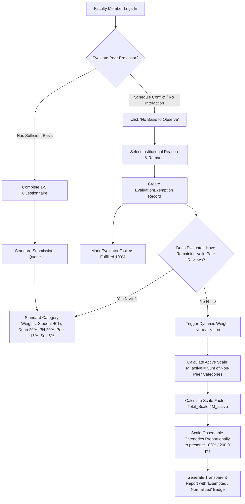
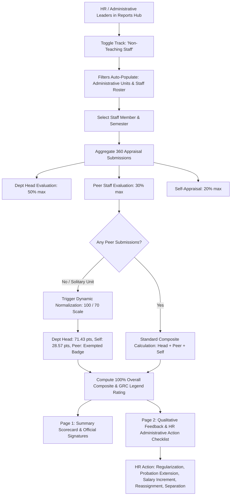

> [!INFO] Navigation
> **Related Notes:** [[Dashboard]] • [[Module Breakdown]] • [[Roles & Permissions]] • [[Task Roadmap & Todo]]

# Git Workflow: dev → uat → main

## Branch Overview

| Branch | Purpose |
|--------|---------|
| `dev`  | Where you code and add features |
| `uat`  | Testing/QA — client or testers verify it works |
| `main` | Live/production — stable, tested code only |

---

## Full Flow

```
[dev] → push → merge to uat → test → merge to main → sync back down
  ↑                                                         ↓
  └──────────────── pull from main ────────────────────────┘
```

---

## Step 1 — Start: Make sure dev is up to date

```bash
git checkout dev
git pull origin dev
```

---

## Step 2 — Do your work, then commit

```bash
git add .
git commit -m "your message here"
git push origin dev
```

---

## Step 3 — Merge dev → uat

```bash
git checkout uat
git pull origin dev      # bring dev changes into uat
git push origin uat
```

---

## Step 4 — Test on UAT

- Deploy `uat` to your test environment
- Let testers / client verify
- If bugs found → go back to **Step 2**, fix on `dev`, repeat

---

## Step 5 — Merge uat → main

```bash
git checkout main
git pull origin uat      # bring uat changes into main
git push origin main
```

---

## Step 6 — Keep dev and uat in sync with main

> ⚠️ This step is often forgotten. Always sync after merging to `main`.

```bash
# Update dev
git checkout dev
git pull origin main
git push origin dev

# Update uat
git checkout uat
git pull origin main
git push origin uat
```

---

## Quick Reference

| Step | Command | What it does |
|------|---------|--------------|
| 1 | `git checkout dev` | Switch to dev |
| 1 | `git pull origin dev` | Get latest dev from remote |
| 2 | `git add .` | Stage all changes |
| 2 | `git commit -m "msg"` | Commit your work |
| 2 | `git push origin dev` | Push dev to remote |
| 3 | `git checkout uat` | Switch to uat |
| 3 | `git pull origin dev` | Merge dev into uat |
| 3 | `git push origin uat` | Push uat to remote |
| 5 | `git checkout main` | Switch to main |
| 5 | `git pull origin uat` | Merge uat into main |
| 5 | `git push origin main` | Push main to remote |
| 6 | `git pull origin main` | Sync branches back with main |

---

# Evaluation Engine Workflows

## Peer Evaluation "Unable to Observe" Exemption & Dynamic Normalization



### Business Rules & Edge Cases:
1. **Audit Requirement:** An evaluator cannot anonymously or silently skip an evaluation. Every exemption requires selecting a recognized accreditation reason (`schedule_conflict`, `different_specialization`, `new_faculty`, or `other` with mandatory notes).
2. **Evaluator Duty Fulfillment:** Once exempted, the evaluation is marked as resolved. The evaluator's completion status advances toward 100%, and automated deadline reminders are suppressed.
3. **Non-Penalization Guarantee:** An evaluatee whose peers skipped with no basis is never penalized. The active observable evaluation categories (Students, Supervisors, Self) expand proportionally to fill 100% of the composite score.
4. **Accreditation Transparency:** The faculty individual report card explicitly notes when dynamic normalization was triggered, maintaining compliance with CHED and NBC 461 standards.

---

## Non-Teaching Staff Performance Appraisal Workflow



### Staff Appraisal Scoring Breakdown:
- **Department Head (50.0 pts / 50%):** Evaluates Job Knowledge & Quality of Work (12.5 pts), Customer Service & Communication (12.5 pts), Initiative & Time Management (12.5 pts), Attendance & Professional Ethics (12.5 pts).
- **Peer Staff (30.0 pts / 30%):** Evaluates Collegiality, Professional Competence, and Ethical Conduct.
- **Self-Appraisal (20.0 pts / 20%):** Evaluates Self-Rating and Commitment to Departmental Objectives.
- **Rating Legend (100% Base):** Excellent (>=95%), Very Satisfactory (85-94.99%), Satisfactory (75-84.99%), Need Improvement (65-74.99%), Poor (<65%).